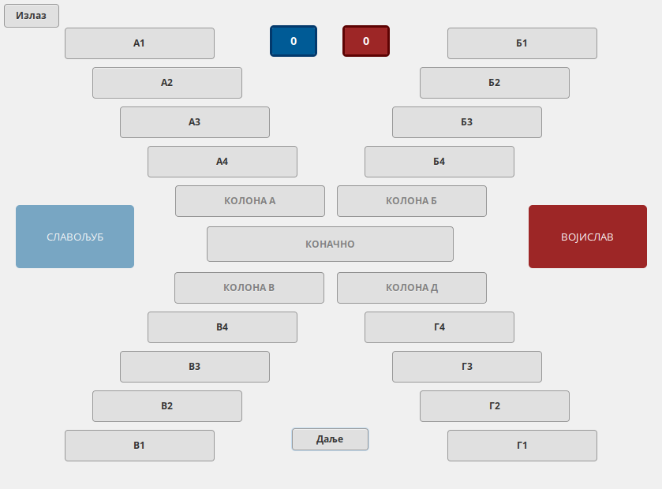

# asocijacije

Program `asocijacije` je implementacija istoimene igre iz kviza *Slagalica* u Haskell programskom jeziku. Ovaj program je napisan za potrebe kursa [Programski jezici](http://www.programskijezici.matf.bg.ac.rs/) na [Matematičkom fakultetu](http://www.matf.bg.ac.rs/) u Beogradu.



## Instalacija

Za kompajlicaju programa je potrebno standardno razvojno okrženje za Haskell (`ghc` + `cabal`). Program se kompajlira tako što se unutar glavnog foldera pokrene komanda (samo prilikom prvog kompajliranja)

```
cabal sandbox init
```

Zatim se generise `gresource.c` fajl u `src` direktorijumu uz pomoć komande

``
glib-compile-resources
``

Na kraju se kompajlira program

```
cabal install -j
```

Izvršni fajl će se generisati u direktorijumu `.cabal-sandbox/bin`. Da bi se pokrenuo, potrebno je da se kopiraju fajlovi iz direktorijuma `asset` u `.cabal-sandbox/bin`.

Umesto opisanog postupka, lakše je koristiti skriptu `easyCompile.sh`. Ova skrita prihvata tri argumenta, `-first`, `-compile` i `-run` koji redom odgovaraju inicijalizaciji cabal sandbox-a, kompilaciji programa i pokretanju programa.

### Biblioteke

Programa koristi sledeće biblioteke:

+ base     
+ filepath
+ gi-cairo
+ gi-gdk
+ gi-gdkpixbuf
+ gi-gio
+ gi-gtk
+ haskell-gi-base
+ text 
+ json
+ directory
+ random
+ containers

Ako program kompajlirate na način koji je gore opisan, tada će se `cabal` sam pobrinuti za preuzimanje i instalaciju svih potrebnih biblioteka. Imajte na umu da taj proces može potrajati preko sat vremena. 

## Upotreba

Pogledati RTS1 radnim danom u 19h.

## Autori

Autori programa su Filip Filpović i Nikola Ubavić, studenti Matematičkog fakulteta u Beogradu.

## Licenca

Program je licenciran MIT licencom. Za više informacija pogledajte fajl [LICENSE](LICENSE).
